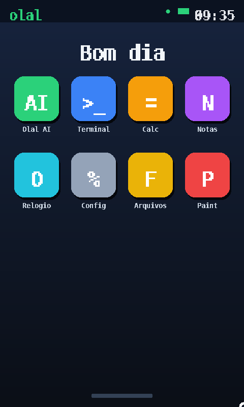

# Olal OS — *ia OS*

Um sistema operacional **escrito do zero**, com bootloader em Assembly x86 e
kernel em C, rodando em **modo protegido de 32 bits**. Tem interface gráfica
estilo Android (tela de 480×800, em pé), funciona com **toque/clique de
verdade**, e traz uma **rede neural rodando dentro do próprio kernel** — por
isso, uma *ia OS*.



## O que ele tem

- **Bootloader** (`boot/boot.asm`): carrega o kernel do disco via leitura LBA
  estendida da BIOS, habilita A20, monta a GDT e entra em modo protegido.
- **Kernel em C** (`kernel/`):
  - framebuffer linear **480×800 32bpp** (proporção de celular) via Bochs-VBE,
    localizado por varredura **PCI**, com **double buffering**;
  - biblioteca gráfica própria: retângulos arredondados, gradientes, círculos,
    alpha-blend e **fonte 8×16** própria;
  - driver de **mouse/touch PS-2** e leitura do **relógio (RTC)**;
  - **FPU (x87)** inicializada para a IA usar ponto flutuante.
- **Interface estilo Android**: papel de parede, barra de status com relógio,
  grade de apps coloridos, navegação por toque e **teclado virtual QWERTY**.
- **8 aplicativos**: Olal AI, Terminal (com comandos), Calculadora, Notas,
  Relógio, Config, Arquivos e Paint (desenho com o dedo).
- **Olal AI** — uma **rede neural char-level (MLP, ~43 mil parâmetros)**
  treinada em português que roda **inteira dentro do kernel**: forward pass,
  softmax e amostragem, com `exp`/`tanh` próprios em x87. É pequena (recombina
  o corpus de treino), mas é uma rede neural **de verdade**, em bare-metal.

## Como está montado

```
BIOS → boot.asm (16 bits) → modo protegido 32 bits → kernel C (480×800)
                                                         ├── gfx / fonte
                                                         ├── ps2 (touch) / rtc
                                                         ├── ui (teclado, botoes)
                                                         ├── apps (8 apps)
                                                         └── ai  (rede neural)
```

## Compilar e rodar (no PC)

Pré-requisitos: `nasm`, `gcc` (multilib 32 bits), `qemu-system-i386`, `make`.
Para retreinar a IA também: `python3` + `numpy` + `pillow`.

```sh
make            # gera build/olal.img
make run        # roda no QEMU (use o mouse: clique e arraste)
make clean
```

## Rodar no celular (Android) com toque de verdade

O sistema roda no navegador via [v86](https://github.com/copy/v86). A pasta
`web/` traz um wrapper que converte **toque em clique absoluto** (toca = clica
exatamente onde tocou).

**Hospedando (recomendado — toque perfeito):**

```sh
make serve      # sobe http://localhost:8000  (ou hospede a pasta web/)
```

Ou ative o **GitHub Pages** apontando para a pasta `web/` do repositório e
abra a URL no celular. O arquivo `web/olal.img` já vai junto.

> Observação honesta: o kernel foi testado no **QEMU** (tudo funcionando:
> navegação, apps, calculadora, teclado e a IA gerando texto). O caminho do
> **navegador/v86** foi montado com a API correta, mas não pôde ser testado
> neste ambiente — se a tela ficar preta ou o toque sair torto, é provável
> que seja o endereço do framebuffer no v86 (ajuste fácil).

## Treinar a própria IA

Edite o corpus em `tools/corpus.txt` e rode:

```sh
python3 tools/train.py     # treina e regrava kernel/model.h
make
```

## Estrutura

```
boot/boot.asm      bootloader (16 -> 32 bits)
kernel/entry.asm   stub de entrada (inicia pilha + FPU, chama kmain)
kernel/kernel.c    main, video (PCI+VBE), home, navegacao
kernel/gfx.c       biblioteca grafica + fonte
kernel/ui.c        botoes, barra de topo, teclado virtual
kernel/apps.c      os 8 aplicativos
kernel/ai.c        inferencia da rede neural
kernel/ps2.c       mouse/touch     kernel/rtc.c  relogio
kernel/util.c      mem*/str*/itoa
linker.ld          layout do kernel em 0x10000
tools/train.py     treino da IA (numpy) -> kernel/model.h
tools/genfont.py   gera kernel/font8x16.h
web/index.html     wrapper v86 com toque absoluto
```
